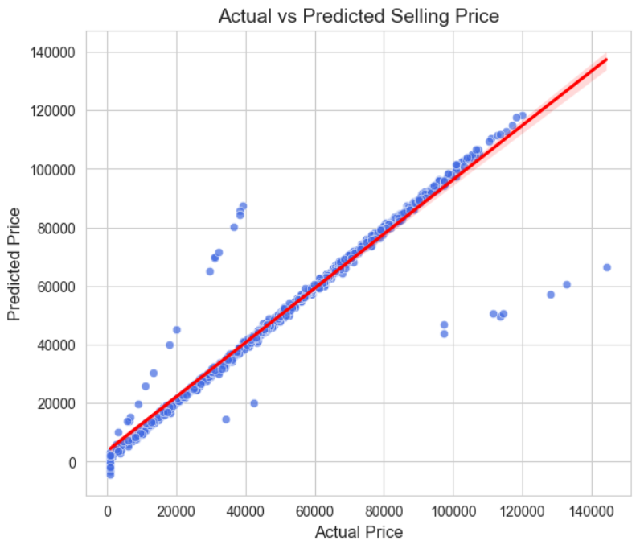
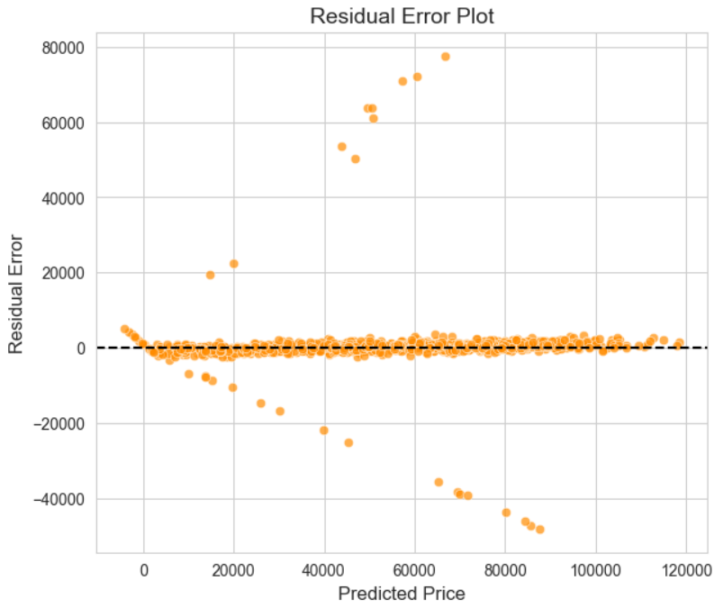
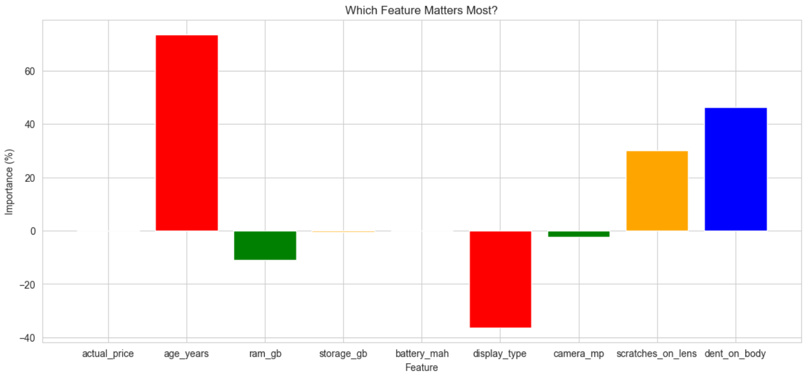

# 📱 Mobile Price Prediction

This project predicts the **selling price of used smartphones** using machine learning.

The model analyzes phone features such as **RAM, storage, battery capacity, camera quality, display type, and phone age** to estimate the resale price.

---

## 🚀 Models Used

- Linear Regression  
- Random Forest Regressor  
- Decision Tree Regressor  

The models are trained and compared, and the **best model is selected based on R² score**.

---

## 📊 Evaluation Metrics

The models are evaluated using:

- R² Score  
- Mean Absolute Error (MAE)  
- Mean Squared Error (MSE)  
- Root Mean Squared Error (RMSE)

---

## 📈 Model Visualizations

### Actual vs Predicted Price

---

### Residual Error Plot

---

### Feature Importance

---

## 🔮 Example Prediction

Example phone used for prediction:

- Actual Price: 65000  
- Age: 2 Years  
- RAM: 8GB  
- Storage: 128GB  
- Battery: 5000 mAh  
- Display Type: AMOLED  
- Camera: 50MP  

The trained model predicts the **expected selling price of the phone**.

---

## 🛠️ Technologies Used

- Python  
- Pandas  
- NumPy  
- Matplotlib  
- Seaborn  
- Scikit-Learn
